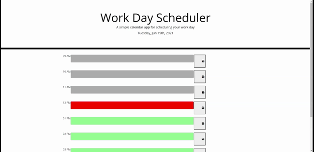

# work-day-scheduler

## Description

This application helps with work day planning of busy schedules by showing you which times have passed or are yet to come with easy color coordination. From there you can easily store your plans for the day and manage time. Uses HTML, CSS, JQuery, and JavaScript.

## Installation

Follow provided link to application:
https://kimberlyseddon.github.io/work-day-scheduler/ 

To begin planning please choose a time block and type your plan, then press save. To clear a completed task just empty the input area and save it blank.
Hint: the green colored blocks are yet to come, the gray have passed, and the current time should be red.

## Usage
Plan your busy work day more effectively with this easy to use planner. 

## Credits

Used moment.js API to keep track of time and display date.